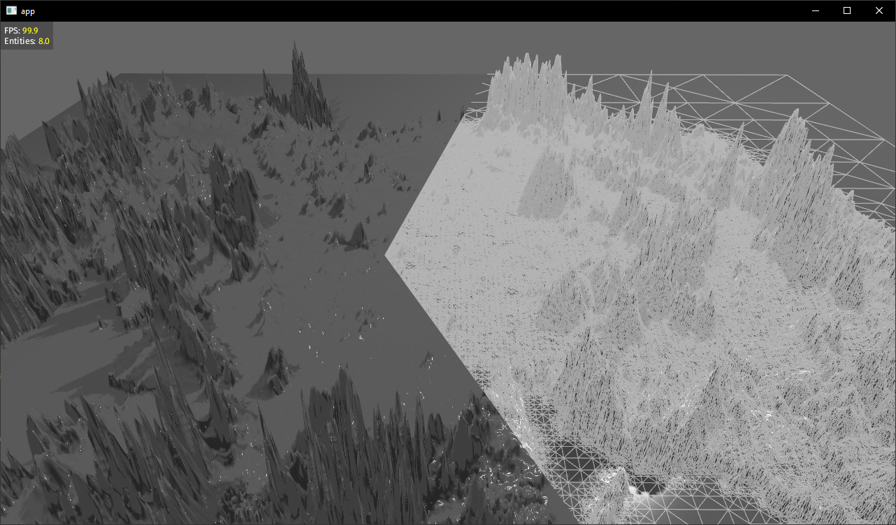

# heightmap experiments in bevy

This implements [RTIN][1] for reducing the number of triangles without sacrificing details. The current implementation
is basically copied from [Volodymyr Agafonik's Observable post][0].

It loads the height map from an image file (png, jpg, something like that). Just run the project and drop a file in.

This is a work in progress, learning project. This does not attempt to be anything useful. There is a lot to do here: I
do not understand a lot of what's going on, therefore I do not understand a lot of weird artifacts. LoDs depending on
the camera view would be nice as well, and RTIN should give us the tool to do that.

[0]: https://observablehq.com/@mourner/martin-real-time-rtin-terrain-mesh

[1]: https://www.cs.ubc.ca/~will/papers/rtin.pdf
